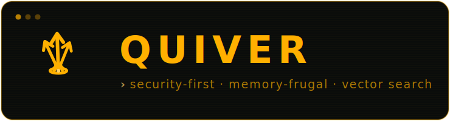

<div align="center">



**The security-first vector database.** Client-side-encryptable, memory-frugal approximate-nearest-neighbour search that runs on a laptop — with a retro terminal cockpit.

[](./LICENSE)
[](./rust-toolchain.toml)
[](.github/workflows)
[](https://github.com/achref-soua/quiver/releases)
[](./docs/roadmap.md)
[](https://github.com/achref-soua/quiver/stargazers)

</div>

> **Status: `v0.1.0` released · Phase 2 (memory frugality) in progress.** Phase 1 shipped the single-node core — an encrypted, crash-safe storage engine, HNSW, SIMD kernels, REST/gRPC, the TUI, and the Python SDK. Phase 2 is building the memory-frugal serve path: the disk-resident DiskANN/Vamana index and quantization are in; the storage engine has been rewritten to the row-addressed on-disk format (stride-addressed vector columns, paged payload heaps, roaring tombstones, compaction, and secondary indexes). Every performance/memory claim in this README is backed by a reproducible benchmark on documented reference hardware — until those numbers are recorded, that table stays empty rather than guess.

## Why Quiver

Native-Rust vector databases already exist; Quiver is not trying to out-scale Milvus or out-feature Qdrant. Its defensible edge is the **combination** of three things, executed well:

- **Security-first, by default** — encryption-at-rest is on out of the box, sealing every durable byte (segments, manifest, **and** the write-ahead log) with XChaCha20-Poly1305; payloads can be client-side-encrypted so the server never sees them; API-key scopes, RBAC, tenant isolation, audit, and crypto-shredding. Only audited cryptography (RustCrypto AEAD/KDF + `rustls`) — never a home-grown primitive.
- **Memory frugality** — a disk-resident graph index (DiskANN/Vamana) plus quantization (product / scalar / binary) serve large datasets from a laptop's RAM budget. The headline metric is **memory at a fixed recall**.
- **Developer experience** — a single static binary; embeddable *and* server modes; a `ratatui` cockpit; idiomatic Python/TypeScript SDKs; an MCP server so agents can drive it.

We say plainly what we do **not** do: client-side encryption protects *payloads, not vectors*; billion-scale needs a server, while a laptop comfortably serves tens-to-hundreds of millions; there is no homomorphic search in core. See the honest [threat model](./docs/security/threat-model.md).

> *The name.* A quiver holds arrows, and an arrow is a vector — apt for a database of them. And in mathematics a *quiver* is a directed graph, which is exactly what an HNSW or Vamana index is. The cockpit wears that identity in amber phosphor.

## Architecture

A Cargo workspace: a from-scratch storage engine, index structures, SIMD distance kernels, and query planner, with a thin gRPC/REST shell and a TUI client. One binary runs the server, the cockpit, and the MCP server.

→ [System context](./docs/architecture/c4-context.md) · [Container view](./docs/architecture/c4-container.md) · [Overview & crate map](./docs/architecture/overview.md) · [ADRs](./docs/adr)

## Quickstart

Pre-built binaries and container images are on the roadmap; today, build from source:

```bash
# prerequisites: rustup (stable), just (cargo install just), and uv
git clone https://github.com/achref-soua/quiver
cd quiver
just demo             # build, start an encrypted server, seed a demo collection
# then, in another terminal:
quiver tui --api-key quiver-demo-key   # the retro cockpit
```

`just demo` brings up a server with **encryption-at-rest on**, seeds a small
collection through the Python SDK, and prints how to open the cockpit. To build
and exercise the workspace directly:

```bash
just build            # compile the workspace
just verify           # the full local quality gate (lint · test · doc · deny · audit)
cargo run -p quiver-cli -- --help
```

```bash
# planned (build from source today):
cargo install quiver-cli       # or: docker run ghcr.io/achref-soua/quiver
quiver serve                   # gRPC + REST, encrypted by default
quiver tui                     # the cockpit
quiver mcp                     # MCP server (stdio) so AI agents can drive Quiver
```

The [MCP server](./docs/mcp.md) exposes `create_collection`, `upsert`, `search`,
`get`, and `delete` as tools over JSON-RPC stdio, operating an encrypted
in-process database.

## Command reference

All developer tasks run through [`just`](./justfile):

| Command | What it does |
|---|---|
| `just build` | build the workspace (all targets) |
| `just test` | run the test suite |
| `just lint` | `cargo fmt --check` + `clippy -D warnings` |
| `just verify` | **the gate** — lint · test · doc · deny · audit |
| `just test-py` | Python SDK test suite (via `uv`) |
| `just run` / `just tui` | run the server / the cockpit |
| `just demo` | encrypted server + seeded demo collection |
| `just bench *ARGS` | run the benchmark harness (e.g. `just bench --synthetic`) |
| `just coverage` | HTML coverage report |
| `just docker` | build the container image |

CI workflows exist under [`.github/workflows`](.github/workflows) but are **manual-only** (`workflow_dispatch`) by design — the authoritative gate is local `just verify` ([ADR-0015](./docs/adr/0015-ci-policy.md)).

## SDK & benchmarks

The **Python SDK** lives in [`sdks/python`](./sdks/python) (`uv add quiver-client`):

```python
from quiver import Client, Point

with Client("http://127.0.0.1:6333", api_key="…") as q:
    q.create_collection("items", dim=3, metric="cosine")
    q.upsert("items", [Point("a", [0.1, 0.2, 0.3], {"tag": "x"})])
    hits = q.search("items", [0.1, 0.2, 0.3], k=5)
```

The **TypeScript SDK** lives in [`sdks/typescript`](./sdks/typescript) (`pnpm add quiver-client`), dependency-free over the global `fetch`, and can pick the memory-frugal disk index:

```ts
import { Client } from "quiver-client";

const q = new Client("http://127.0.0.1:6333", { apiKey: "…" });
await q.createCollection("items", 3, { metric: "cosine", index: "disk_vamana", pqSubspaces: 1 });
await q.upsert("items", [{ id: "a", vector: [0.1, 0.2, 0.3], payload: { tag: "x" } }]);
const hits = await q.search("items", [0.1, 0.2, 0.3], { k: 5 });
```

A **LangChain** `VectorStore` adapter ships in `quiver.langchain` (`pip install quiver-client[langchain]`), so any Quiver index — including the memory-frugal disk path — backs a LangChain retriever.

An `ann-benchmarks`-style harness lives in [`bench/`](./bench). On **SIFT1M** (1M × 128, L2), in-memory HNSW (`M=16`, `efC=200`), recall@10 vs exact ground truth:

| `ef_search` | 16 | 32 | 64 | 128 | 256 |
|---|---|---|---|---|---|
| **recall@10** | 0.794 | 0.898 | 0.960 | 0.987 | 0.996 |

Recall is a property of the index and the data (host-independent), so these figures stand; reproduce with `cargo run --release --example sift_recall` ([details](./docs/benchmarks/results/sift1m.md)). **Throughput, memory (RSS — the headline metric), and the head-to-head vs Qdrant/LanceDB are reference-hardware-pending**: per the [methodology](./docs/benchmarks/methodology.md) those require identical dedicated hardware, this shared dev box is not a source for them, and we never fabricate.

The per-collection **recall ↔ latency ↔ memory** knobs — quantizers (scalar/product/binary), the disk-resident DiskANN path, and IVF — are documented with a tradeoff table in [`docs/benchmarks/quantization-tradeoffs.md`](./docs/benchmarks/quantization-tradeoffs.md).

The **disk-resident path** is the memory-frugality wedge. On SIFTSMALL (128-d), it serves recall@10 up to **1.000** while holding only PQ codes in RAM — a **32× smaller RAM-resident footprint** than full-precision vectors (the graph and vectors live in the encrypted on-disk index). That reduction is exact arithmetic and scales (e.g. a 10M × 768-d collection: ~1 GB resident vs ~31 GB). The head-to-head **RSS vs Qdrant/LanceDB** is reference-hardware-pending. Numbers and method: [`docs/benchmarks/results/disk-path.md`](./docs/benchmarks/results/disk-path.md).

## Configuration

Every option is an environment variable with a secure default; see [`.env.example`](./.env.example) and [ADR-0013](./docs/adr/0013-config-and-secure-defaults.md). Encryption-at-rest is on by default: the server requires a 256-bit key in `QUIVER_ENCRYPTION_KEY` (generate one with `openssl rand -hex 32`) unless `QUIVER_INSECURE=true`, and seals segments, the manifest, and the WAL alike. TLS is required for any non-loopback bind.

## Project

- **Roadmap & Definitions of Done** — [`docs/roadmap.md`](./docs/roadmap.md)
- **Security policy** — [`SECURITY.md`](./SECURITY.md) · **Threat model** — [`docs/security/threat-model.md`](./docs/security/threat-model.md)
- **Contributing** — [`CONTRIBUTING.md`](./CONTRIBUTING.md)
- **License** — [AGPL-3.0-only](./LICENSE)
