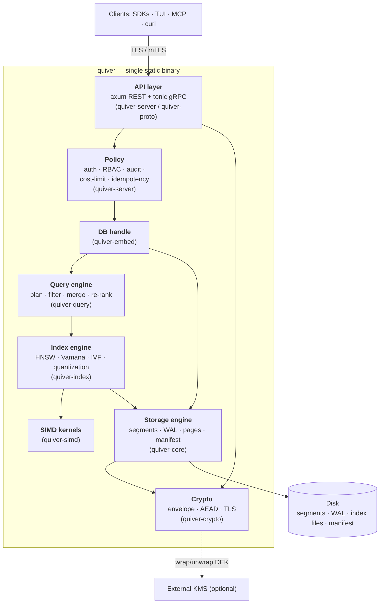

# C4 — Container View (Level 2)

The logical containers inside the single `quiver` binary and the disk they share. Crate names in parentheses map containers to the workspace (see [`overview.md`](overview.md)).

**Reading the diagram**

- The **API layer** is the only network-facing container; it terminates TLS and hands every request to the **Policy** container before any data is touched. In embedded mode these two containers are absent — callers use `quiver-embed` directly.
- The **DB handle** (`quiver-embed`) is the seam between policy/transport and the engine. Server mode and library mode share it, so the engine is exercised identically in both.
- **Storage** is the sole owner of disk and the sole caller of **Crypto** for at-rest encryption; the index engine persists its graph/quantizer artifacts *through* storage, so encryption-at-rest covers index files too.
- **SIMD kernels** are a pure compute leaf with no I/O, making them trivially unit- and micro-benchmarkable in isolation.
- The **TUI** and **MCP server** are not drawn inside the engine: they are API clients (own subcommands of the binary) so they work against local *and* remote instances.

See the component-level breakdown of the storage and index engines in [`../storage/on-disk-format.md`](../storage/on-disk-format.md) and [`../index/design.md`](../index/design.md).
