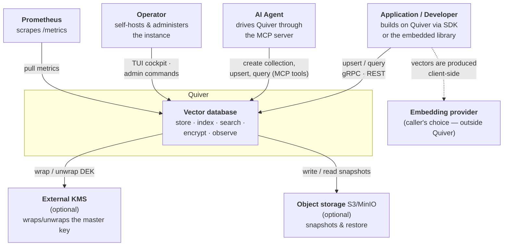

# C4 — System Context (Level 1)

How Quiver sits among its users and the external systems it touches. (Rendered as a flowchart for reliable GitHub display; semantics follow the C4 model.)

**Notes**

- **Embeddings are out of scope.** The developer's application turns content into vectors using whatever model it likes; Quiver stores and searches the resulting vectors. An optional embedder hook exists for convenience but is never required (ADR-0018).
- **KMS and object storage are optional.** Default deployment runs self-contained: the master key comes from the environment/file and snapshots go to the local filesystem. KMS and S3/MinIO are opt-in for production hardening.
- **Trust boundary.** Everything inside *Quiver* is one process. With client-side payload encryption enabled, payload plaintext never crosses into that boundary — the server stores and returns opaque ciphertext (see the threat model).
