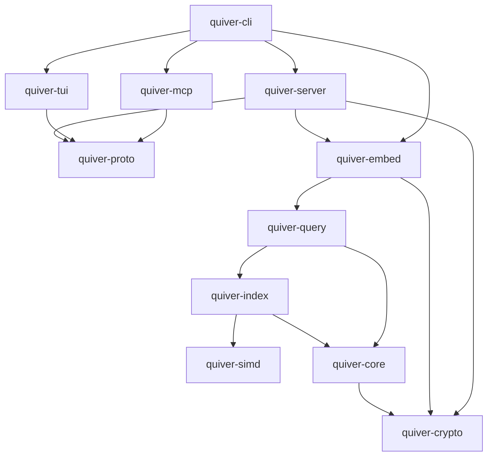

# Quiver — Architecture Overview

Quiver is a native-Rust vector database. It stores vectors and structured payloads, builds approximate-nearest-neighbour (ANN) indexes over them, and answers top-k similarity queries with optional metadata filtering — over gRPC, REST, an embeddable library API, and an MCP server, with a retro terminal cockpit for operators.

## The wedge (and the non-goals)

Quiver competes on a narrow, defensible edge, not on raw scale or feature count:

1. **Security-first, by default.** Encryption-at-rest is on out of the box with secure defaults; payloads can be client-side-encrypted so the server never sees plaintext; strong authN/Z, audit, and crypto-shredding. Only audited cryptography (`rustls`, RustCrypto/`ring`) — never a primitive of our own.
2. **Memory frugality.** Disk-resident graph/inverted indexes plus quantization (product, scalar, binary) let large datasets serve from a laptop's RAM budget. The headline benchmark metric is **memory footprint at a fixed recall**, not just QPS.
3. **Developer experience.** A single static binary; embeddable *and* server modes; a `ratatui` cockpit; idiomatic Python and TypeScript SDKs; an MCP server so agents can drive it.

**Explicit non-goals for v1** (stated to keep the project honest): out-scaling Milvus/Pinecone; distributed clustering (single-node excellence first; replication is a clearly-labelled stretch); homomorphic-encrypted search in core (only a *published* distance-comparison-preserving scheme, behind an experimental flag, with honest leakage caveats). Embeddings are produced by the caller — Quiver stays model-agnostic.

## Workspace map

The core (storage, indexes, kernels, query planner, on-disk format, wire protocol) is built from scratch. A minimal set of vetted crates is used only where reinventing would be reckless (async runtime, TLS, crypto, serialization, TUI). **No embedded database engine is used** (no RocksDB/LMDB/sqlite).

| Crate | Responsibility | Notable external deps |
|---|---|---|
| `quiver-simd` | SIMD distance kernels (cosine/L2/dot/hamming), runtime CPU-feature dispatch, scalar fallback | none (uses `std`/`core::arch`) |
| `quiver-crypto` | Thin wrappers over audited crypto: envelope encryption, AEAD, KDF, key hierarchy, TLS config | `ring`/RustCrypto, `rustls` |
| `quiver-core` | Storage engine: segments, mmap + page/buffer manager, WAL, manifest, compaction, snapshots; the collection/payload model | `memmap2`, `crc32c` |
| `quiver-index` | HNSW (in-mem), DiskANN/Vamana (disk), IVF; quantization (PQ/scalar/binary) | — |
| `quiver-query` | Query planner; hybrid filtered search (vector + metadata predicate + optional BM25); top-k merge & re-rank | — |
| `quiver-proto` | Wire types: gRPC service (`tonic`/`prost`), REST DTOs, OpenAPI generation | `tonic`, `prost`, `serde` |
| `quiver-embed` | Embeddable in-process database handle — the clean Rust API over core+index+query+crypto | — |
| `quiver-server` | The daemon: `axum` REST + `tonic` gRPC, auth, RBAC, audit, query cost limits (ADR-0040), config, observability | `axum`, `tonic`, `tokio`, `tracing` |
| `quiver-tui` | The `ratatui` cockpit (API client; works local or remote) | `ratatui`, `crossterm` |
| `quiver-mcp` | MCP server exposing Quiver as agent tools | MCP SDK / `rmcp` |
| `quiver-cli` | Single binary entrypoint: `serve`, `tui`, `mcp`, `admin`, `bench` | `clap` |

### Dependency DAG (acyclic by construction)

Domain logic lives in the lower crates (`core`/`index`/`query`/`crypto`); framework code (HTTP, gRPC, TUI, MCP) stays at the edges. This keeps the engine testable in isolation and reusable in embedded mode.

## Operating modes

- **Embedded library** — `quiver_embed::Database::open(path, config)?` gives an in-process handle: no network, no auth surface, encryption-at-rest still on. For tests, notebooks, and apps that want a local vector store.
- **Server** — `quiver serve` exposes gRPC + REST with auth, RBAC, multi-tenant namespaces, audit, query cost limits (ADR-0040), and observability. The TUI and MCP server are API clients of it.

Both ship in one static binary; `quiver-server` is a thin network/policy shell over `quiver-embed`.

## Request lifecycles

**Write (upsert):** client → server (TLS terminate → authenticate → authorize scope → cost-limit check → idempotency check) → `quiver-embed` → `quiver-core` appends a WAL record (encrypted, checksummed) and stages the vector + payload into the active segment → `quiver-index` inserts the vector into the live index → ack after WAL `fsync` (durability boundary). Payload secondary indexes updated transactionally with the segment.

**Query (top-k + filter):** client → server (authn/z) → `quiver-query` plans the filter strategy (pre-filter via metadata bitmap when selective; post-filter otherwise) → `quiver-index` runs ANN search (HNSW/Vamana/IVF), using `quiver-simd` kernels on quantized vectors → candidate set re-ranked with exact distances against full-precision vectors fetched & decrypted from `quiver-core` → top-k assembled (payloads decrypted at rest; returned as-is if client-side-encrypted) → response with a cursor for pagination.

## Cross-cutting concerns

- **Security layers:** TLS/mTLS in transit (`quiver-crypto`/`rustls`); envelope encryption at rest (per-collection DEK wrapped by a master key, AEAD on segment pages); optional client-side payload encryption (opaque ciphertext to the server); API-key scopes + RBAC + tenant isolation; append-only audit log; crypto-shredding by DEK destruction. See [`../security/threat-model.md`](../security/threat-model.md) and [`../security/crypto.md`](../security/crypto.md).
- **Observability:** OpenTelemetry-compatible `tracing` spans across server→query→index→core; Prometheus `/metrics`; structured logs; `/healthz` + `/readyz`.
- **Configuration:** typed, validated config with secure defaults; secrets via env + KMS pattern (see ADR-0013).

## Where to read next

- C4 system context — [`c4-context.md`](c4-context.md); container view — [`c4-container.md`](c4-container.md).
- Decisions — [`../adr/`](../adr/). Roadmap & DoDs — [`../roadmap.md`](../roadmap.md). Risks — [`../risk-register.md`](../risk-register.md).
- The bridge to implementation — [`../repo-scaffold-plan.md`](../repo-scaffold-plan.md).
