# Subsystem diagrams

Every major Quiver subsystem, drawn. Sources live in [`docs/diagrams/*.mmd`](./diagrams/)
(Mermaid) and render to committed SVGs in [`docs/assets/diagrams/`](./assets/diagrams/) via
`just diagrams`. For the narrative tour with 31 hand-drawn figures, see the field guide
[`docs/quiver-explained.pdf`](./quiver-explained.pdf); for the C4 views and crate DAG, see
[`docs/architecture/`](./architecture/).

## Storage & durability

### Payload storage — row-addressed columns & paged heaps


### Online snapshot — consistent backup


### Lock-free MVCC reads


### Deferred index rebuild — state machine


## Indexing & retrieval

### Secondary (metadata) indexes & filter evaluation


### BM25 sparse / hybrid retrieval


### Multi-vector / ColBERT late interaction


### Vector quantization — PQ / scalar / binary


### Server-side embedding hooks


## Query safety

### Query cost limits & DoS protection


## Distributed

### Dynamic cluster membership


### gRPC streaming APIs

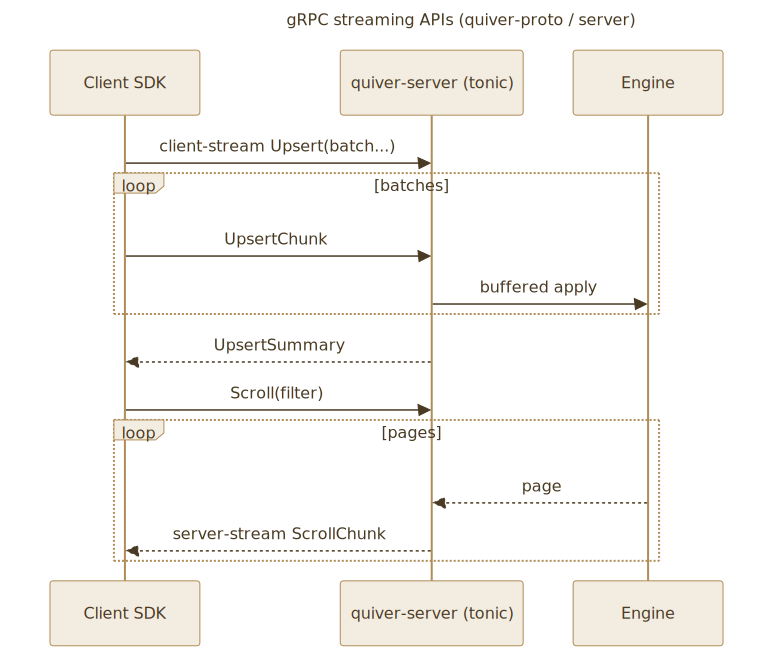

## Security

### Envelope key hierarchy & KMS


### TLS / mTLS termination

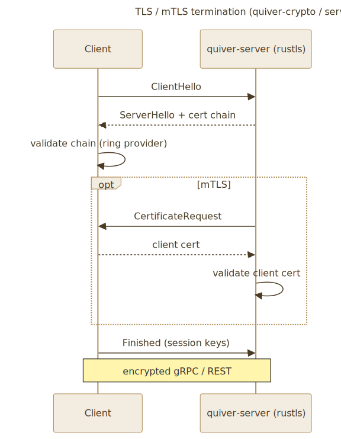

### Authentication & RBAC


### Append-only audit log


## Operability

### Observability — metrics, tracing, OTLP


## Integration

### Migration importers (Qdrant / Chroma / pgvector)

