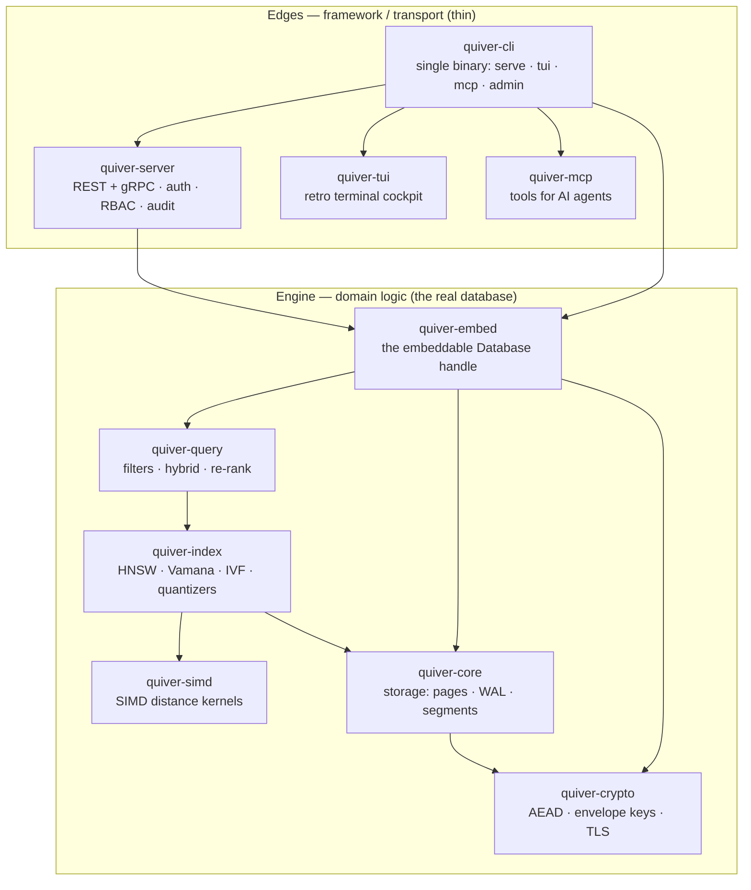
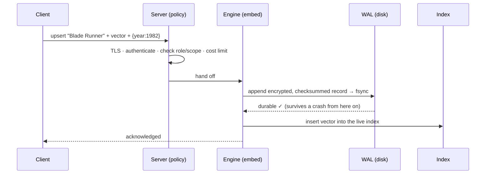
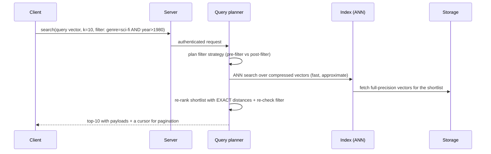
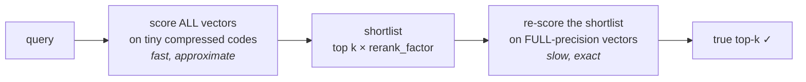

# Quiver, Explained — From "What Is a Vector?" to a Production Vector Database

*A complete, plain-English tour of how a modern vector database actually works — using Quiver, an open-source, security-first engine written in Rust, as the worked example. No prior AI knowledge assumed. If you already know the field, the "Under the hood" boxes go all the way down.*

---

## How to read this article

This piece is written for **two readers at once**:

- **If you've never touched AI or databases**, read straight through. Every concept is introduced with a real-world analogy and a concrete example before any jargon appears. You can skip the grey *"Under the hood"* passages and still understand everything.
- **If you build software**, the same sections carry the engineering depth: the algorithms, the data structures, the trade-offs, and the actual numbers — with the design decisions explained, not just stated.

We'll keep one running example the whole way through: **a movie recommendation search.** "Find me films that *feel like* *Blade Runner*." By the end you'll know exactly what happens, byte by byte, when that query runs.

---

# Part 1 — The Big Idea: Turning Meaning Into Numbers

## 1.1 The problem with keywords

Imagine you run a movie site. A user types: *"a moody sci-fi about androids and identity."*

A traditional database searches with **keywords**. It looks for the literal words "moody," "sci-fi," "androids." But *Blade Runner*'s description might say "a replicant hunter in a neon dystopia." Zero shared keywords — yet it's a perfect match. Keyword search is **blind to meaning**.

What we actually want is **search by meaning, not by spelling.** That is the entire reason vector databases exist.

## 1.2 What is an "embedding"? (the single most important idea)

Here's the trick that powers all of modern AI search:

> **You can turn any piece of content — a sentence, an image, a song, a product — into a list of numbers that captures its *meaning*. That list of numbers is called an *embedding* (or a *vector*).**

A vector is just an ordered list of numbers, like:

```
Blade Runner  →  [0.91, -0.20, 0.74, 0.05, ... ]   (say, 768 numbers)
```

Each number is a coordinate along some invisible "axis of meaning." You can think of these axes loosely as *"how sci-fi is it?", "how romantic?", "how violent?", "how hopeful?"* — except a real AI model discovers thousands of subtle axes on its own, far richer than words we'd name.

**The magic property:** things that *mean* similar things get *nearby* numbers. *Blade Runner* and *Ghost in the Shell* end up close together. *Blade Runner* and *Paddington 2* end up far apart. Meaning becomes **geometry**.

> 🔑 **The mental model.** Picture a giant map. Every movie is a pin on it. Similar movies cluster into neighborhoods — the "gritty sci-fi" district, the "feel-good comedy" district. Searching "find films like *Blade Runner*" becomes: *drop a pin where the query lands, and look at its nearest neighbors on the map.* A real map has 2 dimensions; an embedding map has hundreds or thousands. The idea is identical.

Who makes these numbers? An **embedding model** (a neural network like OpenAI's `text-embedding-3`, Cohere, or an open model). You feed it text or an image; it returns the vector.

> **Under the hood.** Quiver is deliberately **model-agnostic**: *you* produce the embeddings with whatever model you like, and Quiver stores and searches them. It never bundles a model. This is a design choice — embedding models change monthly, and tying a database to one would age it instantly. Quiver's job starts the moment you have vectors.

## 1.3 "Similar" means "close" — but close *how*?

If meaning is geometry, then **similarity is distance**. Two questions follow: how do we measure distance, and which measure is right?

There are three standard ways, and Quiver supports all three. Here's the intuition for each:

| Metric | Plain-English meaning | Best for | "Closer" means |
|---|---|---|---|
| **Cosine similarity** | Do the two arrows point the *same direction*? (ignores length) | Text/semantic search — the most common choice | Higher value (max = 1.0) |
| **Euclidean / L2 distance** | How far apart are the two points, by a ruler? | Image embeddings, spatial data | Smaller distance |
| **Dot product** | Direction *and* magnitude together | Recommender systems, "maximum inner product" | Higher value |

A picture for the two big ones:

```
   COSINE (angle)                        EUCLIDEAN / L2 (ruler)

        B                                     A •
       ↗                                        \
      ↗   small angle = similar                  \  distance
     ↗                                            \
    A ────────→                              B •───┘
   (length ignored)                       (straight-line gap)
```

> 💡 **Why cosine wins for text.** A long document and a short tweet about the same topic point the *same direction* but have very different *lengths*. Cosine ignores length and asks only "same topic?" — exactly what you want. That's why it's the default for semantic search.

> **Under the hood.** Quiver normalizes cosine internally: it scales every vector to length 1, after which **cosine similarity reduces to a plain dot product**. This is a small but important trick — it means the engine only needs fast code for two operations (dot product and squared-L2), and cosine comes "for free." Internally, every metric is converted to a uniform *"smaller is closer"* orientation (it negates the similarity scores) so all the search machinery can use one comparison rule and never get confused about direction.

## 1.4 The scaling wall: why we can't just compare everything

Naively, finding the nearest neighbors is easy: compare the query to *every* stored vector, sort, take the top few. This is **brute force** (or "exact" / "flat" search).

It's also a trap. With 1,000 movies, comparing all of them is instant. With **100 million** documents, each 768 numbers long, every single query would do ~76 *billion* multiplications. Per query. That's hopeless for a live website.

So vector databases make a bargain:

> **Approximate Nearest Neighbor (ANN) search:** give up *guaranteeing* the absolute perfect top-10, in exchange for being **100–1000× faster** while still being right ~95–99% of the time.

That trade — a tiny, controllable sacrifice in accuracy for an enormous speedup — is the heart of every vector database. The accuracy you keep is called **recall**, and it's the number to watch.

> 🔑 **Recall, defined once.** *Recall@10* = "of the 10 truly-nearest items, how many did the fast approximate search actually find?" Recall of 0.96 means it found 9.6 of the true top 10 on average. Brute force always has recall 1.0 but is slow; ANN trades a sliver of recall for speed. **Every benchmark in this article is reported *at a fixed recall*, because speed without recall is meaningless** (you can be infinitely fast by returning garbage).

---

# Part 2 — What Quiver Is, and Why It's Different

Now that the concepts are clear, here's the product.

> **Quiver is an open-source vector database written in Rust.** You give it vectors (plus optional metadata like `{"year": 1982, "genre": "sci-fi"}`), and it answers "find the *k* most similar" queries in milliseconds — over a network API, an embeddable in-process library, or as a tool that AI agents can call directly.

There are already excellent vector databases (Pinecone, Milvus, Qdrant, Weaviate, FAISS, pgvector). Quiver doesn't try to beat them at raw scale. It competes on a **narrow, deliberate edge** — three things, executed well:

### The wedge

```
┌──────────────────────────────────────────────────────────────────┐
│  1. SECURITY-FIRST, BY DEFAULT                                     │
│     Encryption is ON out of the box. Your data is sealed on disk. │
│     You can even encrypt vectors so the server itself never sees  │
│     them. Only audited, industry-standard cryptography.           │
├──────────────────────────────────────────────────────────────────┤
│  2. MEMORY FRUGALITY                                              │
│     Serve hundreds of millions of vectors from a laptop's RAM    │
│     budget, using disk-resident indexes + compression (~32× less │
│     memory). The headline metric is RAM-at-a-fixed-recall.       │
├──────────────────────────────────────────────────────────────────┤
│  3. DEVELOPER EXPERIENCE                                          │
│     A single static binary. Runs embedded OR as a server. A      │
│     retro terminal "cockpit." Python & TypeScript SDKs. An MCP   │
│     server so AI agents can drive it.                            │
└──────────────────────────────────────────────────────────────────┘
```

### And — just as important — what Quiver honestly says it does *not* do

A trustworthy system is clear about its limits. Quiver states plainly:

- It is **single-node first**. It won't out-scale a distributed Milvus cluster. (Async read-replicas exist as a clearly-labelled stretch feature.)
- Client-side encryption protects **payloads, not vectors** — unless you opt into a special experimental mode (more on that later) with documented leakage.
- There's **no fully homomorphic "search on encrypted data with zero leakage"** — because no such scheme is fast enough to be practical today, and it won't pretend otherwise.

> 💡 **Why this honesty matters.** A database is infrastructure you bet your company's data on. The README contains a striking rule: *"Every performance/memory claim is backed by a reproducible benchmark on documented hardware — until those numbers are recorded, the table stays empty rather than guess."* That discipline — never fabricating a number — is itself a feature.

---

# Part 3 — The Architecture, Top to Bottom

## 3.1 The shape of the system

Quiver is a **Cargo workspace**: a collection of small, focused Rust libraries ("crates"), each with one job, stacked so that low-level engine pieces never depend on high-level network pieces. This is what keeps a large codebase understandable and testable.



The rule the arrows enforce: **the engine knows nothing about HTTP, gRPC, or terminals.** The network code is a thin shell wrapped around the same engine that the embeddable library exposes. The practical payoff: the hard part (the database) is exercised identically whether you run it as a server or `import` it into a Python notebook.

> **Under the hood — the crate map.**
> - `quiver-simd` — the raw arithmetic: distance between two vectors, as fast as the CPU allows. Pure compute, no I/O. *(~640 lines)*
> - `quiver-crypto` — thin, careful wrappers over *audited* cryptography (encryption, key management, TLS). Never a home-grown cipher. *(~2,650 lines)*
> - `quiver-core` — the storage engine built from scratch: pages, the write-ahead log, segments, the manifest/catalog, compaction. **No embedded database (no RocksDB/SQLite/LMDB) is used** — this is hand-built. *(~6,200 lines)*
> - `quiver-index` — the ANN indexes (HNSW, Vamana/DiskANN, IVF) and the quantizers (the compression). *(~5,700 lines)*
> - `quiver-query` — the query planner: metadata filtering, hybrid search, result merging and re-ranking. *(~490 lines)*
> - `quiver-embed` — stitches it all into one clean `Database` API. *(~3,400 lines)*
> - `quiver-server`, `quiver-tui`, `quiver-mcp`, `quiver-cli`, `quiver-proto` — the edges.
>
> The whole thing is **Rust (edition 2024)**, AGPL-3.0 licensed, and ships as **one static binary** that contains the server, the cockpit, and the agent server. A workspace-wide lint policy *forbids* `unwrap()`/`expect()` (the two easiest ways to make Rust crash), forcing every error to be handled explicitly.

## 3.2 Two ways to run it

| Mode | What it is | When to use |
|---|---|---|
| **Embedded library** | `Database::open(path)` — an in-process handle. No network, no auth surface, but encryption-at-rest still on. | Tests, notebooks, desktop apps, anything local. |
| **Server** | `quiver serve` — gRPC + REST with authentication, role-based access, multi-tenant namespaces, audit logging, and query cost limits. | Production, shared services. |

The same binary does both. The terminal cockpit (`quiver tui`) and the AI-agent server (`quiver mcp`) are just **clients** of the server API, so they work against a local *or* a remote Quiver.

## 3.3 What happens when you write, and when you search

Let's trace our movie example end to end.

**Writing a movie ("upsert"):**



The crucial line is **"append → fsync → durable."** The write is acknowledged only *after* it's been flushed to disk. We'll see in Part 5 why this is what lets Quiver survive a `kill -9` or a power cut with zero lost (acknowledged) data.

**Searching ("find films like *Blade Runner*, but only sci-fi after 1980"):**



Notice the two-phase pattern that shows up *everywhere* in Quiver: **a fast, approximate pass to get a shortlist, then a slow, exact pass on just the shortlist.** Cheap to narrow millions down to a hundred; affordable to be perfectly precise on the final hundred. Keep this pattern in mind — it's the unifying idea of the engine.

---

# Part 4 — The Engine, Block by Block

This is the heart of the article. We'll go from the bottom (raw arithmetic) up to the clever data structures.

## 4.1 The speed floor: SIMD distance kernels

Every search, no matter how clever, eventually computes "how far apart are these two vectors?" thousands of times. If that one operation is slow, *everything* is slow. So it's the foundation.

**The naive way** (scalar): multiply element 1 × element 1, then element 2 × element 2, ... one at a time, 768 times.

**The fast way (SIMD — "Single Instruction, Multiple Data"):** modern CPUs can multiply *8 numbers at once* with a single instruction. It's the difference between a cashier scanning one item at a time versus a scanner that reads 8 barcodes in one pass.

```
Scalar:   [a1]×[b1] → [a2]×[b2] → [a3]×[b3] → ...   (1 at a time)
SIMD:     [a1 a2 a3 a4 a5 a6 a7 a8]
        × [b1 b2 b3 b4 b5 b6 b7 b8]   → all 8 multiplied in ONE step
```

> **Under the hood.** `quiver-simd` provides hand-written kernels for cosine, squared-L2, dot product (over 32-bit floats *and* 8-bit integers), and **Hamming distance** (bit-counting, used for binary compression — see §4.4). At runtime it *detects the CPU's features* (`is_x86_feature_detected!("avx2")`) and dispatches to the AVX2/AVX+FMA path if available, falling back to portable scalar code otherwise — so the same binary runs fast on a modern server and *correctly* on an old one. Every SIMD path is **differential-tested**: a property test feeds random vectors of awkward lengths (0, 1, 7, 769 — deliberately not multiples of 8, to exercise the leftover "tail") into both the SIMD and scalar versions and asserts they agree. Fast code you can't trust is worthless; this is how they earn the trust.

## 4.2 The core trick of ANN: navigable graphs

Now the big question: how do you find the nearest neighbors among 100 million vectors *without* comparing them all?

The most successful answer is a **proximity graph**. The idea is beautiful and simple:

> Build a network where each vector is a node, connected by "friendship" links to a handful of its nearby vectors. To search, **start anywhere and keep walking to whichever friend is closer to your query, until you can't get closer.** Like finding a house by repeatedly asking "which of your neighbors lives closest to this address?" — you converge in a few hops, never visiting the whole city.

Quiver implements the two best-known proximity-graph families: **HNSW** and **Vamana (DiskANN)**.

### HNSW — the "skip-list of maps"

HNSW (Hierarchical Navigable Small World) adds one idea to the proximity graph: **layers**, like a zoomed-out highway map on top of a detailed street map.

```
        Layer 2 (sparse — the "highways"):   A ───────────── F
                                              │               │
        Layer 1 (more nodes):         A ──── C ──── D ─────── F
                                      │      │      │         │
        Layer 0 (everyone — "streets"): A-B-C-D-E-F-G-H-I-J-K-L  ← all vectors
```

You enter at the top, sparse layer and take big leaps to get into the right *region* fast. Then you drop down a layer, refine. Then drop to the bottom, dense layer where *every* vector lives, and do a careful local search to nail the exact neighbors. Coarse-to-fine, geographically.

> **Under the hood — the knobs.**
> - **`M`** (default 16): how many friends each node keeps. More friends = better recall, more memory.
> - **`efConstruction`** (default 200): how hard it searches *while building* the graph. Higher = better graph, slower build.
> - **`ef_search`**: how hard it searches *at query time* — the size of the "candidate beam" it keeps. **This is your live recall ↔ speed dial.** Crank it up for accuracy, down for speed. (You'll see this exact knob in the benchmark table.)
>
> Two refinements lift Quiver's HNSW above a textbook version:
> 1. **The diversity heuristic** (the paper's Algorithm 4): when choosing a node's friends, it doesn't just take the *M* closest — it prefers friends that point in *different directions*, so edges span the space instead of all clumping toward one cluster. This materially improves recall on real, clustered data.
> 2. **Soft deletes** (ADR-0026): deleting a movie doesn't rip it out of the graph (which could disconnect the network). It's *tombstoned* — kept as a stepping-stone for navigation but never returned in results. The search automatically *widens its beam* to compensate for the dead nodes it walks through, so recall holds even after many deletes. A rebuild later reclaims the space.

### Vamana / DiskANN — the graph built for *disk*

HNSW is brilliant but assumes the graph lives in RAM. **Vamana** (the algorithm behind Microsoft's DiskANN) builds a *single flat graph* (no layers) specifically engineered so it can live on an **SSD** and still answer queries with very few disk reads. This is the key to Quiver's memory-frugality wedge.

Its two ingredients:
- **GreedySearch** — beam search from a fixed central entry point (the "medoid," the most central vector).
- **RobustPrune with the α-slack rule** — the secret sauce. When picking a node's neighbors, it keeps the closest one, then *drops any candidate that the already-chosen neighbor is more than α× closer to.* This forces edges to span *long distances* across the space (not just connect near-duplicates), so greedy search reaches anywhere in very few hops — which means very few SSD page reads.

We'll see in §4.5 how this graph + compression delivers the "32× less RAM" claim.

### IVF — the "library card catalog"

The third index, **IVF (Inverted File)**, takes a completely different, often-simpler approach: **divide and conquer by neighborhood.**

```
Step 1 (once): cluster all vectors into, say, 1000 "cells" (Voronoi regions)
               via k-means. Each cell has a centroid (a representative point).

        ┌─────────┬─────────┬─────────┐
        │  cell 1 │  cell 2 │  cell 3 │   Every vector is filed under
        │  •  •   │   • •   │  •      │   its nearest centroid, like
        │ • • •   │  • •  • │ • • •   │   books filed by section.
        └─────────┴─────────┴─────────┘

Step 2 (per query): find the few centroids nearest the query ("nprobe" of them),
                    then ONLY scan the vectors filed in those cells.
```

You don't search the whole library — you walk to the 3 most relevant sections and browse only those. **`nprobe`** (how many cells to check) is the recall ↔ speed dial here. IVF builds fast and has a very predictable memory profile, which is why Quiver keeps it as a sturdy alternative to the graph indexes.

> **Under the hood.** Quiver's IVF supports **incremental updates** with "SpFresh-style LIRE rebalancing" — as you stream inserts and deletes, cells that grow too big *split* and ones that shrink *merge*, so the index stays balanced without a full `O(N)` rebuild. It supports L2 and cosine; for dot-product ("maximum inner product") workloads, HNSW is used instead.

**Choosing an index — the cheat sheet:**

| Index | Lives in | Strength | Use when |
|---|---|---|---|
| **HNSW** | RAM | Highest QPS at high recall | You have the RAM and want raw speed |
| **Vamana / DiskANN (`disk_vamana`)** | SSD (compressed in RAM) | Tiny RAM footprint | Datasets bigger than your RAM budget |
| **IVF** | RAM or SSD | Fast build, predictable memory, easy updates | Streaming data, simpler tuning |

> **Under the hood — all three update incrementally.** A naïve ANN index rebuilds from scratch on every write, which is fatal for streaming data. Quiver's three families avoid that: HNSW inserts and **soft-deletes** in place (tombstones); IVF uses **SpFresh-style LIRE** rebalancing so cells split and merge as data streams in; and the Vamana graphs use **FreshDiskANN's StreamingMerge** — a read-only base graph plus a small in-memory delta graph and an O(1) deletion set, consolidated only past a churn threshold. So graph writes are size-independent, the index stays a *derived* structure (the WAL is the source of truth, so the crash gate is untouched), and the only rebuild that ever happens is the deferred, off-lock one of §5.4.

## 4.3 Quantization: the memory-frugality superpower

Here's a problem. One million vectors × 768 dimensions × 4 bytes per number = **3 GB of RAM**, just for the vectors. Ten million 768-d vectors = **31 GB**. That doesn't fit on a laptop.

**Quantization** is lossy compression for vectors: shrink each one into a tiny "code," search using the codes, and accept slightly fuzzy distances. Quiver ships three quantizers, from gentle to aggressive:

| Quantizer | Code size | Compression | How it works |
|---|---|---|---|
| **Scalar (SQ)** | `dim` bytes | ~4× | Store each number as an 8-bit integer instead of a 32-bit float |
| **Product (PQ)** | `m` bytes | up to **32×** | Split the vector into chunks; replace each chunk with the ID of its nearest "prototype" from a learned codebook |
| **Binary (BQ)** | `dim/8` bytes | ~32× | Keep only the *sign* of each number (1 bit each); compare with ultra-fast bit-counting |

**Product Quantization, explained simply.** Imagine describing a face. Instead of exact measurements, you say "nose type #7, eyes type #3, jaw type #12." If everyone agrees on a catalog of nose/eye/jaw types, those three small numbers reconstruct the face approximately. PQ does exactly this: it learns a *codebook* of prototype chunks (via k-means), then represents each vector as a handful of prototype IDs. A 768-float vector (3072 bytes) becomes maybe 96 bytes — **32× smaller.**

But here's the genius that makes lossy compression safe:

> ### The Approximate-Then-Re-rank pattern (the engine's golden rule)
>
> 1. **Rank cheaply on the tiny codes.** Use the compressed vectors to *quickly* find, say, the top 100–800 candidates. Fast, but fuzzy.
> 2. **Re-rank precisely on the originals.** Fetch the *full-precision* vectors for only that shortlist, compute *exact* distances, and return the true top 10.
>
> The compression speeds up the 99% of work (narrowing millions to hundreds); the exact re-rank guarantees the final answer is precise. **You recover almost all the recall you'd "lost" to compression.**



The size of that shortlist is the **`rerank_factor`** — the master dial trading recall against latency/memory. A deeper shortlist can only *add* true matches, so recall rises monotonically as you widen it. (Quiver's tests prove exactly this property.)

> **Under the hood.** PQ uses **asymmetric distance computation (ADC)**: the query stays full-precision and a small lookup table is precomputed once per query, so scoring each compressed code is just a few table lookups and adds — extremely fast. Binary quantization leans on the SIMD **Hamming kernel** from §4.1: it XORs the sign-bit codes and counts the differing bits, which a CPU does blisteringly fast, making it ideal as a coarse pre-filter for high-dimensional vectors before the exact re-rank.

## 4.4 Putting it together: the disk-resident path (the "32×" headline)

This is Quiver's signature feature, and now you have every piece to understand it.

Combine the **Vamana graph** (§4.2, built for SSD) with **Product Quantization** (§4.3, 32× smaller):

```
   IN RAM (small, fast)                ON SSD (big, encrypted)
   ┌────────────────────┐             ┌─────────────────────────┐
   │ PQ codes (32× tiny) │  navigate  │ full-precision vectors   │
   │ + ids + codebook    │ ─────────→ │ + graph neighbor links   │
   └────────────────────┘             │ (mmap'd, decrypted on    │
        ▲                              │  demand, page by page)   │
        │ cheap approximate hops       └─────────────────────────┘
        │                                        │
        └──── re-rank exactly ◄──────────────────┘
              (read only the visited pages)
```

- Only the **tiny PQ codes** stay in RAM — used for cheap, approximate navigation through the graph.
- The **full vectors and graph live on the SSD**, memory-mapped and decrypted *only when a page is actually visited*.
- The final shortlist is **re-ranked with exact distances** read from those few visited pages.

The result, in Quiver's own measured terms: a dataset serves from **roughly its PQ-code footprint** instead of the full vectors. For a 10M × 768-d collection, that's about **~1 GB resident instead of ~31 GB** — the arithmetic is exact and it's why "hundreds of millions of vectors on a laptop" is a real claim, not marketing. (On SIFTSMALL it reaches recall@10 up to 1.000 while holding only PQ codes in RAM.)

> **The in-memory floor — and what v0.23.0 fixed.** "Roughly the PQ-code footprint" is a *floor*, not zero: what stays resident is the **PQ codes + the id map + the PQ codebook + a small in-memory FreshDiskANN delta** (recent writes not yet folded into the base graph). The full-precision vectors and base graph are `mmap`'d on disk and demand-paged — that is the whole point. There was a subtlety that undercut the claim *in practice* until **v0.23.0**: a restarted server **rebuilt the disk index from every full-precision vector on open** (only IVF had a fast load path), so its post-restart RSS briefly looked like the in-memory path and the benchmark's post-build number was unrepresentative. The **durable on-disk DiskVamana index** ([ADR-0063](./adr/0063-durable-disk-vamana-index.md)) closes that gap: the server `mmap`s its frugal base and replays only the post-checkpoint WAL tail on open (falling back to the authoritative rebuild on any mismatch, so the `kill -9` gate is untouched), and therefore serves from the resident-PQ floor *immediately after a restart*. The wedge benchmark now **closes and cold-reopens the server before sampling RSS** to measure exactly that floor rather than the build's high-water mark.

## 4.5 Filtering: search by meaning *and* by rules

Real queries are hybrid: *"films like Blade Runner, **but only sci-fi released after 1980**."* That's a similarity search **plus** a structured filter on metadata.

Quiver expresses filters as a **typed predicate tree** you can nest arbitrarily:

```json
{ "and": [
    { "eq":  { "field": "genre", "value": "sci-fi" } },
    { "gt":  { "field": "year",  "value": 1980 } },
    { "not": { "eq": { "field": "rating", "value": "G" } } }
] }
```

It supports `eq`, `ne`, `in`, `lt`, `lte`, `gt`, `gte`, `exists`, and `and`/`or`/`not`, over dot-paths into the JSON payload (`"user.age"`). The interesting part is *how* it runs that filter — the planner picks one of two strategies:

| Strategy | What it does | Chosen when |
|---|---|---|
| **Pre-filter** | First find the rows matching the filter (using a secondary index), then do similarity search *only over those* | The filter is **selective** (matches few rows) — e.g. `user_id = 42` |
| **Post-filter** | Do the similarity search first, then drop results that fail the filter | The filter is **broad** (matches many rows) — e.g. `year > 1980` |

> 💡 **Why both?** Pre-filtering a *broad* filter wastes time building a huge candidate set; post-filtering a *selective* filter risks the similarity search returning 100 candidates that all get filtered out, leaving you with nothing. Picking the right strategy per query is what a planner is *for*. Either way, the filter is **re-checked on every surviving result**, so the answer is always exact — the planner only affects speed, never correctness.

## 4.6 Hybrid search: combining meaning with keywords (RRF)

Sometimes pure semantic search isn't enough — you also want exact keyword/term matching (someone searching a product code like "SKU-4417" wants that *exact* term, not "vibes"). The modern answer is **hybrid search**: run *both* a **dense** (embedding) search and a **sparse** (keyword/term-weight) search, then merge the two ranked lists.

But the two searches produce scores on totally different scales — a cosine similarity of 0.83 and a keyword score of 14.2 can't be added. The elegant fix Quiver uses is **Reciprocal Rank Fusion (RRF)**:

> Ignore the scores entirely. Use only the **rank** (1st, 2nd, 3rd...) in each list. Each list gives a document `1 / (k0 + rank)` points; sum across lists. A document that ranks high in *both* lists wins.

```
RRF score(doc) = Σ  1 / (k0 + rank_in_list)      (k0 = 60, the standard constant)
              over each result list
```

Because it's purely rank-based, RRF needs **no score normalization** — that's exactly why it's the robust, industry-standard fuser. A "sparse vector" in Quiver (e.g. from a SPLADE or BGE-M3 model) rides along inside the point's payload, so enabling hybrid search needs *no change to the on-disk format*.

> **Under the hood — multi-vector / ColBERT.** Quiver also supports **late-interaction (ColBERT-style)** retrieval, where a document is stored not as one vector but as a *set* of token vectors, and ranked by **MaxSim** (for each query token, find its best-matching document token, then sum). This is more accurate for some retrieval tasks. Cleverly, Quiver models each document as a *group of ordinary rows* in the same storage engine — so there's no new on-disk format and the crash-safety guarantees are untouched. A ColBERT corpus (many small token vectors) is exactly the large, low-dimensional pool that the IVF+PQ compression path was built for, so it showcases the memory wedge.

---

# Part 5 — Durability: How It Survives `kill -9`

A database has one sacred promise: **if I told you a write succeeded, that write is not lost — not to a crash, not to a power cut.** Here's the machinery that keeps that promise.

## 5.1 The Write-Ahead Log (WAL)

The idea is older than databases and simple: **write down what you're about to do *before* you do it.** Like a captain's logbook — before changing course, log the new heading. If the ship is interrupted, the log tells you exactly where things stood.

In Quiver, every mutation (create collection, upsert, delete) is:
1. Encoded into a record,
2. **Appended** to the WAL file (an append-only log),
3. **`fsync`'d** — forced all the way down to the physical disk, not just the OS cache,
4. *Only then* acknowledged to the client.

That ordering is the entire guarantee. Once you get the "ok," the record is physically on disk. The actual index update happens *after* the ack — and if the machine dies before it completes, recovery replays the log to redo it.

## 5.2 Catching corruption: checksums and torn writes

What if a crash happens *mid-write*, leaving a half-written record? Or a disk bit silently rots?

Every WAL record is framed with a **CRC32C checksum** (and a length prefix):

```
WAL frame:  [ length:u32 ][ CRC32C:u32 ][ ...the record bytes... ]
```

On recovery, Quiver reads frames until one **fails its length or CRC check** — the unmistakable signature of a crash mid-append — and treats *everything from that point on* as "never happened." This is called **point-in-time recovery**: because the log is append-only and every record was `fsync`'d before its ack, the *only* place a broken frame can legitimately appear is the very tail. A torn trailing record was, by definition, never acknowledged, so discarding it loses nothing.

The same discipline applies to the main data files. Everything is stored in fixed **16 KiB pages**, each with a 32-byte header and its own CRC32C over the contents:

```
Page (16 KiB):
  [ magic | version | type | page_id | lsn | payload_len | CRC32C ]  ← 32-byte header
  [ ...data... | zero padding to 16 KiB ]
```

So **corruption is detected on read and never silently served.** A page that doesn't checksum is an error, not a wrong answer. The page header even records the page *type*, so a segment page can never be accidentally misread as a manifest page.

> 🔑 **The bottom line.** Acknowledged writes survive `kill -9` and power loss; corruption is always *detected* rather than served as a wrong answer; and — critically — all of this holds **whether or not encryption is on**, because the checksums guard the plaintext path and the encryption layer sits *on top*. Quiver's test suite literally kills the process with `kill -9` mid-operation and asserts the data is intact on restart (the "crash gate").

## 5.3 Many readers, one writer

Durability is about *not losing* writes; throughput is about *serving* reads. Quiver is **single-writer, many-reader**: the server guards the engine with a reader–writer lock (ADR-0057). A search takes the *shared* lock, so many searches run **in parallel** — read throughput scales with cores instead of serializing on one mutex. A write takes the *exclusive* lock; the single-writer model, and everything in §5.1–5.2, is unchanged.

There is one subtlety, and it is the whole story of this section. Some writes — an HNSW in-place update, a bulk load, a delete, a replicated write — cannot be absorbed into the index in place, so the engine **defers** the rebuild: it marks the collection stale and leaves the prior, still-valid index in place. The question is what the *next* reader does about it. The naïve answer (what v0.21.0 shipped) is to take the exclusive lock and rebuild before serving. That is correct, but it has a brutal failure mode.

## 5.4 The rebuild that doesn't stop the world

Rebuilding an ANN index is roughly a single-threaded build pass over the whole collection. If a reader does it *under the exclusive lock*, every other reader blocks for the entire build. We measured exactly that, with a reproducible harness (`crates/quiver-embed/tests/mvcc_measurement.rs`, ADR-0062; dev box, HNSW, dim 128, indicative):

| Collection size | single-thread rebuild | steady read p99 (concurrent) | reader stall during rebuild |
|---|---:|---:|---:|
| 20,000 vectors | 7.3 s | 422 µs | **8.1 s** |
| 50,000 vectors | 26.7 s | 379 µs | **29.7 s** |
| 100,000 vectors | 68.7 s | 408 µs | **76.6 s** |

The stall tracks the rebuild duration and is **four to five orders of magnitude** above the steady-state p99 — borne by *every* read that arrives during the window, and worse at scale (a 1M disk-Vamana rebuild is minutes).

> ### The fix — rebuild off the exclusive lock (ADR-0062)
>
> **Serve the prior snapshot, build with no lock held, swap at the end.** A stale reader returns results from the *prior* index (still a valid graph over the prior ids) instead of blocking. Meanwhile one rebuild is driven off-lock: its inputs are captured under the *shared* lock (other reads continue), the new index is built holding **no lock at all**, and only the final pointer-swap takes a brief exclusive lock. A per-collection **write-generation counter** guards against a write that lands mid-build: if the generation moved, the collection stays stale and another rebuild is scheduled — so no write is ever lost.

The seconds-long stall collapses to the cost of serving the prior snapshot (sub-millisecond) plus a brief swap. No `unsafe`, no lock-free data structure, no `loom` — just `Arc` and the existing `RwLock`.

This moves read *visibility*: a server read may briefly miss a write committed a millisecond ago (snapshot isolation, sanctioned by ADR-0053), but never a half-applied one, and the WAL-fsync acknowledgement of §5.1 is byte-for-byte unchanged. Embedded `&mut` callers still rebuild synchronously, so an in-process program always reads its own writes. That fixed the rebuild's *lock scope*; §5.5 closes the remaining gap — the *write's* lock window.

## 5.5 Reads that never wait on a writer — lock-free MVCC

The off-lock rebuild solved the worst case. But even an *ordinary* write has to briefly lock the index to record itself — and a "lock" here means exactly what it sounds like: while the writer holds it, every reader waits at the door. The window is short (milliseconds), but it adds up. We measured how much, by running searches and writes at the same time and asking *what fraction of its read speed does the database keep?* (1.0× would mean writes cost reads nothing.) The answer was sobering: **one** steady writer dropped reads to about a tenth of their speed, and a **second** writer collapsed them to almost nothing — the readers spend their time waiting at the door, not searching.

The fix is a classic database trick called **MVCC — multi-version concurrency control**. Picture a librarian reorganising a shelf. The slow way: she closes the whole reading room while she works, and everyone waits. The MVCC way: she leaves the current shelf untouched for readers, prepares an updated copy off to the side, and swaps it in the instant it's ready — readers never stop, and never catch the shelf half-finished. Quiver does exactly this with a search index (ADR-0064), behind an off-by-default `QUIVER_MVCC_READS` switch.

> **Keep a frozen copy; keep recent edits on a sticky note.** The writer keeps the last fully-built index frozen as a **snapshot**. New writes that arrive afterwards don't disturb it — they go onto a small **overlay**, like a sticky note that says "*also include these few new points, and ignore those deleted ones*" (a deleted point is marked with a **tombstone** — a note that it's gone, rather than erasing it on the spot). A reader picks up the current snapshot in a single, instant step that needs no lock — that lock-free hand-off is what the **`arc-swap`** library gives us — then searches the frozen index, glances at the short sticky note, and combines the two. Because the note stays small, the writer can rewrite it cheaply on *every* write; once it grows past a threshold, the next off-lock rebuild folds it into a fresh frozen copy and the note starts blank again. Old copies tidy themselves up: Rust counts how many readers still hold each one and drops it automatically when the last reader walks away — no manual cleanup, no `unsafe` code. And a reader always sees one whole, consistent version — never a write applied halfway.

This is split by *what the read needs*. A plain **vector search** (just "find the nearest points") needs only the snapshot, so it runs entirely lock-free and never waits on a writer. A search that also returns each point's stored data — its payload, or a filter on it — still has to read the main store, which isn't safe to read while the writer is changing it, so those reads take the shared lock as before (but still answer from the snapshot). The common, hot path — nearest-neighbour search — is the one that goes fully lock-free.

The proof is the same sweep on the same box, `QUIVER_MVCC_READS` **off → on**:

| readers vs.   | batch 1 (off→on)  | batch 64 (off→on) | batch 512 (off→on) |
|---|---|---|---|
| **1 writer**  | 0.80× → 0.87×     | 0.66× → 0.71×     | 0.50× → 0.74×      |
| **2 writers** | **0.00× → 0.79×** | 0.35× → 0.75×     | 0.30× → 0.75×      |
| **4 writers** | **0.01× → 0.67×** | 0.06× → 0.69×     | 0.07× → 0.71×      |

The multi-writer collapse is gone: where the `RwLock` starved readers to near zero, MVCC holds **~0.65×–0.79×** retained read-QPS — reads proceed *during* writes. Durability is untouched: MVCC changes *visibility, not durability* — the overlay is derived from the same WAL the store replays, and the `kill -9` gate holds by construction. It ships **opt-in**: the proven `RwLock` path stays the default until the win is confirmed on dedicated hardware (on a shared dev box only the ratio is honest; the absolute QPS is reference-hardware-pending).

---

# Part 6 — Security, the Defining Feature

This is where Quiver makes its strongest claim. Let's go from the disk outward.

## 6.1 Encryption at rest — *on by default*

Most databases make you opt *in* to encryption. Quiver makes you opt *out* (via `QUIVER_INSECURE=true`, which it won't let you do on a non-loopback network bind). Out of the box, the server demands a 256-bit master key (`openssl rand -hex 32`) and **seals every durable byte** — segments, the manifest, *and* the write-ahead log — with **XChaCha20-Poly1305**, a modern, audited authenticated cipher.

"Authenticated" (AEAD) matters: it doesn't just hide the data, it **detects tampering**. Flip a single bit in an encrypted file and decryption *fails loudly* instead of returning subtly wrong data.

> **Under the hood.** Only audited cryptography is used — RustCrypto's AEAD/KDF and `rustls` (backed by the audited `ring` library) for TLS. **No home-grown primitives, ever** — the cardinal rule of applied cryptography. Key material is wrapped in `Zeroizing` types so it's scrubbed from memory when dropped.

## 6.2 Envelope encryption + crypto-shredding (the elegant part)

Here's a genuinely clever design. Instead of encrypting everything with the one master key, Quiver uses a **two-level key hierarchy**:

```
   Master Key (MK)  ← you hold this; it NEVER touches disk
        │  wraps (encrypts)
        ▼
   ┌──────────────┬──────────────┬──────────────┐
   │ DEK for       │ DEK for       │ DEK for       │   one random Data-
   │ collection A  │ collection B  │ collection C  │   Encryption Key
   └──────────────┴──────────────┴──────────────┘   per collection,
        │              │              │              stored WRAPPED on disk
        ▼              ▼              ▼
   A's sealed     B's sealed     C's sealed
   data           data           data
```

Each collection gets its own random **Data-Encryption Key (DEK)**, which is itself stored encrypted ("wrapped") under the master key. Why bother? Because of what it enables:

> ### Crypto-shredding — instant, provable deletion
>
> To permanently and irreversibly delete a collection, Quiver doesn't overwrite gigabytes of data. It just **deletes that collection's tiny wrapped DEK file.** The DEK existed nowhere else. Once it's gone, the collection's encrypted bytes are **mathematically unrecoverable — even by the holder of the master key, even from a backup tape that still has the ciphertext.**

This is the gold-standard pattern for the GDPR "right to erasure." You can prove deletion happened (the key is provably gone) without trusting that every copy of the data on every disk and backup got physically scrubbed. Quiver's test suite demonstrates exactly this: seal a page, shred the collection, then show that a fresh key-ring *with the correct master key* can no longer decrypt it.

## 6.3 In transit and access control

- **TLS / mTLS:** encrypted connections are required for any non-loopback bind. Optional **mutual TLS** (`QUIVER_TLS_CLIENT_CA`) makes clients prove their identity with a certificate, too.
- **Default-deny RBAC:** access is by scoped API key. A key has a **role** (`read` ⊆ `write` ⊆ `admin`) and a **collection scope** (exact names, or a `acme.*` prefix for per-tenant isolation). Over-reach returns `403`; listing even *hides* collections outside your scope.
- **Append-only audit log:** every mutating/admin operation and every denial is recorded — who, what, which resource, what outcome — but **never the secret itself**.
- **Query cost limits:** the server caps how expensive a single query can be, closing off "authenticated denial-of-service" (a valid user crafting a query so heavy it knocks the server over).

## 6.4 The frontier: encrypting the *vectors* themselves

By default, client-side encryption in Quiver protects **payloads** (the metadata) — you can seal `{"ssn": "..."}` with a key the server never sees, while leaving `{"genre": "sci-fi"}` cleartext so the server can still filter on it.

But what about the **vectors**? Can a server rank vectors it can't read? Quiver offers two honest, opt-in answers — and is scrupulously clear about the trade-offs, because **no scheme gives you fast server-side ranking, zero leakage, *and* good performance all at once.**

| Mode | What the server sees | Can the server rank? | Security | Honest cost |
|---|---|---|---|---|
| **`client_side`** | Only opaque ciphertext + a zero placeholder | **No** — it learns *nothing* (genuinely IND-CPA secure) | Strongest | Client fetches the (pre-filtered) set and ranks **locally**. Best for small/medium collections. |
| **`dcpe`** (experimental) | Ciphertext it *can* compare by approximate L2 distance | **Yes** — ranks without holding the plaintext or key | Weaker — **not** semantically secure | **Leaks the approximate distance-ordering by design** (that's how it ranks). Broken by known-plaintext/strong-prior attackers. L2-only. |

The DCPE mode implements a *published* academic scheme (the "Scale-And-Perturb" distance-comparison-preserving encryption, eprint 2021/1666) built only from audited primitives, with the paper's hardening steps (a key-derived component shuffle and an ordering-preserving normalization). The documentation tells you to read the threat model *before* using it.

> 💡 **This is the security-first ethos in miniature.** A lesser project would ship DCPE and call it "encrypted search," full stop. Quiver ships it behind an experimental flag, names the exact academic paper, and spells out precisely what it leaks and which attacker breaks it. That candor is the point.

---

# Part 7 — The Numbers (Honestly Reported)

Performance claims are only worth the methodology behind them. Quiver benchmarks every system on the **same box** (an i7-12700H laptop, 20 threads, 15.5 GB RAM) using an `ann-benchmarks`-style harness, and reports speed **at a fixed recall bar** — because, again, speed at unknown recall is meaningless.

## 7.1 Quiver's own recall ↔ speed curve (SIFT1M: 1M × 128-d, in-memory HNSW)

This single table shows the central trade-off of the whole field. As you turn the `ef_search` dial up, recall climbs and throughput (queries/sec) falls:

| `ef_search` | 16 | 32 | 64 | 128 | 256 |
|---|---|---|---|---|---|
| **recall@10** | 0.793 | 0.895 | 0.958 | 0.986 | 0.995 |
| **QPS** (1 thread) | 1539 | 1424 | 1222 | 955 | 701 |
| **p95 latency** (ms) | 0.8 | 0.8 | 1.0 | 1.3 | 1.7 |

As an ASCII chart of the fundamental tension:

```
recall ▲
 1.00 ┤                                  ● 0.995 (ef=256, 701 QPS)
 0.99 ┤                        ● 0.986 (ef=128, 955 QPS)
 0.96 ┤              ● 0.958 (ef=64, 1222 QPS)
 0.90 ┤        ● 0.895 (ef=32, 1424 QPS)
 0.79 ┤  ● 0.793 (ef=16, 1539 QPS)
      └──┴────┴────────┴─────────────────┴────────→  more search effort →
         (faster)                          (more accurate)
```

You pick your point on this curve per workload. RAG pipeline that re-ranks anyway? Run at ef=64. Legal discovery where a miss is unacceptable? Run at ef=256.

## 7.2 Head-to-head (SIFT1M, peak single-thread QPS at recall@10 ≥ 0.95)

| System | recall@10 | QPS (1T) | p95 (ms) | RSS (MB) | build |
|---|---:|---:|---:|---:|---:|
| FAISS 1.14 | 0.968 | **3842** | 0.4 | 1234 ¹ | 82 s |
| **Quiver v0.20** | 0.958 | **1222** | **1.0** | 2069 | 581 s ² |
| Chroma 1.5 | 0.977 | 1009 | 1.1 | 3752 ¹ | 153 s |
| Weaviate 1.27 | 0.983 | 663 | 1.7 | 2218 | 38 min |
| Milvus 2.5 (server) | 0.986 | 649 | 1.9 | 2075 | 26 s |
| Qdrant 1.13 | 0.974 | 358 | 4.5 | **258** ³ | 98 s |
| pgvector 0.7 | 0.980 | 118 | 11.8 | 1291 | 132 s |
| LanceDB 0.33 | 0.557 ⁴ | 219 | 5.3 | 2475 ¹ | 15 s |

**Quiver lands second only to FAISS** on both throughput and tail latency at this recall bar, with the second-best p95 latency of the whole field — and on the v0.20.0 engine its single-thread QPS rose ~40% over v0.18.0 (870 → 1222 at recall ≥ 0.95). On the harder **GIST1M** (1M × 960-d) test, Quiver *matches FAISS on recall* (0.923 vs 0.919).

The footnotes are where the honesty lives:
- ¹ FAISS/Chroma/LanceDB run *in-process*, so their RAM figures are inflated by the Python harness — not directly comparable to the isolated-server numbers.
- ² Quiver's "build" is now the **bulk-ingest** path (`points:bulk`) measured as honest *time-until-queryable* — ingest plus the deferred index build forced by the first query (581 s, down from v0.18.0's 854 s REST-upload path); in-process FAISS still builds fastest as it skips the network entirely.
- ³ Qdrant memory-maps vectors to disk by default, which is why its RAM looks tiny.
- ⁴ LanceDB's config didn't reach the 0.95 recall bar in this sweep; shown at its best honestly (and it DNF'd GIST1M entirely — a 960-d/1M in-process build exhausts memory).

> 🔑 **The crucial caveat Quiver states itself:** *this table is an in-memory comparison, so it is NOT where Quiver's memory wedge shows up.* The wedge is the **disk-resident path** (§4.4), which holds only PQ codes in RAM for ~32× less memory — and Quiver explicitly marks the head-to-head RAM comparison there as "reference-hardware-pending; we never fabricate." A benchmark table you can trust is one that tells you where it *doesn't* flatter the author.

---

## 7.3 The v0.22.0 dimensions: recall depth, concurrency, and filtering

The v0.22.0 release added four measurement dimensions (ADR-0061), all on the same SIFT1M, all *dev-box · indicative*, and **every number below traces to a committed CSV** in `docs/benchmarks/results/comparison-v0.22.0/`.

**Recall depth.** Recall@10 is the headline, but a RAG pipeline that re-ranks 50 candidates cares about recall@100. At a fixed `ef_search`, recall@100 needs a *deeper* candidate beam than recall@10, so it only catches up once you widen the search:

| ef_search | 16 | 32 | 64 | 128 | 256 |
|---|---|---|---|---|---|
| recall@1 | 0.853 | 0.928 | 0.966 | 0.984 | 0.988 |
| recall@10 | 0.793 | 0.895 | 0.958 | 0.986 | 0.995 |
| recall@100 | 0.918 | 0.918 | 0.918 | 0.944 | 0.983 |

**Saturated concurrency** — the payoff of the §5.3 reader–writer lock and the §5.4 off-lock rebuild: QPS under 8 saturating client threads (NT) versus one (1T). Read it *honestly*: a single Python client process (GIL + one HTTP socket) is itself a concurrency ceiling, so for *light* queries (low `ef`, sub-2 ms) the client saturates first and NT sits at or below 1T; the server-side win appears on *heavier* queries, up to **1.76× at ef=256** (recall 0.995). It is not a fabricated "8×".

| ef_search | 16 | 32 | 64 | 128 | 256 |
|---|---|---|---|---|---|
| QPS (1T) | 1131 | 1001 | 855 | 673 | 506 |
| QPS (8T) | 949 | 968 | 928 | 938 | 892 |
| **speed-up** | 0.84× | 0.97× | 1.08× | 1.39× | **1.76×** |

**Quantization tradeoff.** The disk-Vamana + PQ path holds recall@10 close to in-memory HNSW, but PQ trades away the *deep* tail — recall@100 falls from 0.94 to 0.71. The absolute serving-RAM wedge is **reference-hardware-pending** on the shared dev box: post-build RSS here is the build's allocator high-water mark, while the representative figure is the **cold-reopen** footprint where only the PQ codes (plus the small delta and codebook) stay resident — the metric the durable disk index (ADR-0063, §4.4) finally makes real and the wedge runner now samples *after a cold restart*. So it is omitted, not estimated.

| Config | recall@1 | recall@10 | recall@100 | build (s) | QPS (1T) |
|---|---|---|---|---|---|
| hnsw (in-memory) | 0.984 | 0.986 | 0.944 | 619 | 883 |
| disk_vamana + pq16 | 0.974 | 0.966 | **0.709** | 1025 | 598 |

**Filtered selectivity.** A payload pre-filter keeps `s`% of the collection; recall is measured against the *filtered* exact ground truth. The planner crosses regimes: a very selective filter pre-filters to an *exact scan* (recall ≈ 1.0, but the scan to find the subset is the latency cost — ~142 ms); a looser filter post-filters an ANN result, which dips into a **recall valley** at mid-selectivity before recovering; an empty filter is pure ANN again (878 QPS). The filter is re-checked on every survivor (§4.5), so the valley is a *recall* dip the planner trades for speed, never a wrong answer.

| kept by filter | recall@10 | QPS (1T) | p50 (ms) | regime |
|---|---|---|---|---|
| 1% | 1.000 | 7 | 142.3 | pre-filter · exact scan |
| 5% | **0.618** | 7 | 134.6 | post-filter · recall valley |
| 25% | 0.970 | 5 | 189.2 | post-filter · recovering |
| 50% | 0.981 | 4 | 253.6 | post-filter |
| 100% | 0.986 | 878 | 1.1 | no filter · pure ANN |

---

# Part 8 — The Decisions Behind the Code

Great engineering is visible in the *choices*, especially the restraint. A few that define Quiver, each recorded as an "Architecture Decision Record" (ADR) in the repo:

| Decision | What they chose | Why |
|---|---|---|
| **Language** | Rust | Memory safety without a garbage collector → predictable, low-latency performance and no whole classes of security bugs. |
| **Storage engine** | Built from scratch (no RocksDB/SQLite/LMDB) | Full control over the on-disk format, encryption, and crash semantics — the core differentiators. |
| **Cryptography** | Only audited libraries (RustCrypto, `ring`/`rustls`) | "Don't roll your own crypto" — the one universal rule of security engineering. |
| **Crash safety** | WAL + `fsync`-before-ack + CRC + point-in-time recovery | The non-negotiable database promise, proven by a `kill -9` test gate. |
| **Scope** | Single-node excellence first; distribution is a labelled stretch | Do one thing superbly before doing everything adequately. |
| **Honesty** | No benchmark number ships unless reproducible on documented hardware | Trust is the product when you're storing someone's data. |
| **Error handling** | `unwrap()`/`expect()` *banned* by lint | Force every failure to be handled — no surprise panics in production. |

The throughline: **correctness and security first, performance second, features last — and never lie about any of them.**

---

# Part 9 — Beyond Search: RAG, Full-Text & Operations

A search engine is only half a product. The rest is the work of *using* it — turning text into vectors, mixing keyword and meaning, backing data up, watching the system breathe, and keeping one noisy client from starving the others.

## 9.1 Bring your own *nothing*: server-side embedding

The number-one friction in retrieval is the embedding step. Quiver stays model-agnostic at its core, but at the **edge** (never in the engine) it offers an opt-in, per-collection embedding hook. `upsert_text` sends a document's words; the server embeds them with the collection's configured provider and stores the vector. `search_text` embeds your query the same way, searches, and can **rerank** the shortlist with a second, sharper model — retrieve-then-rerank in one call. Providers are chosen by configuration, never hard-wired: OpenAI, Ollama (local), any OpenAI-compatible HTTP endpoint, Cohere, or a deterministic `fake` for tests. Secrets are never stored — a config field names an *environment variable*, resolved at startup so a missing key fails fast.

Our running example, finally as real calls — a `movies` collection that embeds text (payloads like `{"year":1982}` ride along):

```python
upsert_text("movies", "br",   "Blade Runner — a replicant hunter in a neon dystopia")
upsert_text("movies", "gits", "Ghost in the Shell — a cyborg cop questions identity")
upsert_text("movies", "pad",  "Paddington 2 — a kind bear clears his name")

search_text("movies", "a moody sci-fi about androids and identity", k=2, rerank=True)
#   → [ br (0.83), gits (0.79) ]   Paddington is correctly far away
```

Those two verbs are not just SDK methods — `upsert_text` / `search_text` are exposed as **MCP tools** (ADR-0058) via a shared `quiver-providers` crate, so an autonomous agent can build and query a corpus in plain words, with no embedding model of its own.

## 9.2 Full-text without leaving home: BM25

Sometimes you want the *exact word* — a product code, a name, an acronym a model has never seen. Quiver tokenises text (Unicode split, lowercase, stop-words, a **Snowball/Porter2 stemmer** so "running"/"runs"/"ran" conflate), builds an inverted index, and scores with **Okapi BM25** — the lexical workhorse behind Lucene. A single `query_text` runs dense, lexical, or both, fused with **RRF** (Reciprocal Rank Fusion).

## 9.3 Backups that don't stop the world

An **online snapshot** captures a consistent copy of a *running* database. Under the single-writer lock, the engine **checkpoints** (seals the in-memory buffer into segments and advances the WAL floor to the head), then byte-copies the whole data directory — layout-independent, so it can never drift out of sync with the file format. Opening the copy replays an empty WAL tail and is identical to the source at snapshot time. Reachable over the engine, REST (`POST /v1/snapshot`), the MCP server, and every SDK; the crash gate is untouched.

## 9.4 Scaling reads: leader & followers

Quiver is single-node first, but reads can fan out. Point a follower at a leader (`QUIVER_LEADER_URL`) and it bootstraps from a snapshot, then tails the leader's writes **asynchronously** — no consensus, no failover, no write coordination. Followers are read-only warm standbys that absorb query load; the leader stays the single writer, so durability and the crash gate are exactly as Part 5 describes. A clearly-labelled stretch feature: read scale-out without the cost of consensus, eventually consistent, with the leader the one source of truth.

## 9.5 Seeing inside: metrics, tracing & OpenTelemetry

Quiver serves a Prometheus `/metrics` endpoint (open, so a scraper needs no key) with per-route request counters and latency histograms, plus security counters (`quiver_auth_failures_total`, `quiver_rate_limited_total`); engine operations carry secret-free `tracing` spans, and an importable Grafana dashboard ships in `infra/grafana/`. New in v0.22.0, those spans can be **exported over OpenTelemetry** (ADR-0059): opt in behind the `otlp` build feature and a runtime endpoint (`QUIVER_OTLP_ENDPOINT`), and the existing spans stream over OTLP/gRPC to Jaeger, Tempo, or Grafana — off by default (a normal build links no extra dependency, and a failed exporter degrades to console logging rather than failing startup). The metrics defined here are the vocabulary the guide measures in: **recall@k** (fraction of the true k neighbours returned), **QPS** (queries/second), **p50/p95/p99** (tail latency), **RRF** (rank-based list fusion), **IDF** (rare-word weighting, the heart of BM25), **RSS** (physical RAM held — the memory-frugality headline), and **build time** (time to first query).

## 9.6 Fairness under load: per-key rate limiting

Each API key gets a **token bucket** that refills at a steady rate up to a burst capacity; every request spends a token. Over-rate requests get `429 Too Many Requests` with `Retry-After` and the standard `RateLimit-*` headers. Opt-in (off by default), enforced at one auth choke point so *every* REST and gRPC call is covered, and per-node in memory.

## 9.7 The client fleet: SDKs, agents, and the cockpit

One engine, many front doors: SDKs for **Python** (sync + async), **TypeScript**, and **Go** (standard-library only), each mirroring the same surface — collections, points, search, hybrid, full-text, server-side embedding, and snapshots. The three are kept at **method parity**: alongside the core calls, each carries the same bulk/maintenance helpers — batched upload (`upsertIter` / `UpsertBatch`), a `scroll` over a whole collection for export and re-embedding, and a paged `deleteByFilter` for GDPR erasure — with the TypeScript client taking a sync *or* async iterable and the Go client a context on every call. For AI agents, an **MCP server** exposes the database as tools — create, upsert, search, hybrid, `database_stats`, `delete_collection`, `snapshot`, and (v0.22.0) the text tools `upsert_text` / `search_text` — so an agent can *operate* Quiver, in plain words, not just query it.

The last front door is for humans. `quiver tui` opens a retro terminal **cockpit** in the Bronze Quiver palette — a live dashboard of connection health, a collections table with load bars, points-trend and ingest-rate sparklines, and an activity log. New in v0.22.0 (ADR-0060) it became *interactive*: press `/` for a **query runner** (type a question, run a server-side `search_text`, inspect any result's payload), `?` for a keybinding overlay, and `Ctrl-t` to toggle a Slate theme. Pressing `v` on a collection opens the **constellation view** — a 2-D projection of the vector space you can pan and zoom to *see* how your data clusters. Every screen renders to a buffer behind a render-to-buffer API, so each is unit-tested with ratatui's `TestBackend` and the screenshots are generated from the *real* render — they never go stale.

Quiver also slots into your stack. **Migration importers** pull data straight from a *running* source — `quiver admin import --qdrant-url` / `--chroma-url` / `--postgres-url` stream collections from Qdrant, Chroma, and pgvector/Postgres with no export step — and because the SDKs mirror the common retrieval interfaces, Quiver is usable as a **LangChain** / **LlamaIndex** vector store and a **Haystack** `DocumentStore`, so an existing RAG pipeline can point at it by swapping one component.

Everything above ships in **one static binary**. For source and registry distribution the crates publish under the **`quiverdb-*`** namespace (ADR-0056) — each package is `quiverdb-<crate>` while its library name stays `quiver_<crate>` and the binary stays `quiver`, so imports and `cargo install --path` are unchanged. A multi-stage Docker image, a docker-compose, and a Helm chart round out the deploy story; secure defaults mean the server refuses to start on a non-loopback bind without a master key and TLS.

## 9.8 Scaling out: sharding & scatter-gather

One node already serves tens of millions of vectors, but eventually a dataset outgrows a single machine — or writes outpace one writer. Quiver's answer (ADR-0065, opt-in) is to **shard**: split the collection across N independent Quiver servers and put a thin **router** in front. Set `QUIVER_CLUSTER_SHARDS` to the shard URLs and the same server binary *becomes* that router — clients talk to it exactly as they would a single node.

Think of a library that has grown too big for one room. You split the books across several rooms, and a front desk — the router — knows which room holds what. To *file* a book (a write), the desk sends it to its one owning room. To *find the ten most relevant books* (a search), the desk asks **every** room for its ten best and merges those shortlists into the overall ten. That is a **scatter-gather**, and the merge is exact: the global top-ten can only be drawn from the rooms' individual top-tens, so collecting ten from each and keeping the best ten is guaranteed correct.

Which room owns a book is decided by **rendezvous hashing** of the book's id. The valuable property: add or remove a room and only about `1/N` of the books change hands — not a wholesale reshuffle. That is the foundation for **dynamic, elastic scaling**: grow or shrink the cluster under live load by moving only the small slice that moves. (Online rebalancing, a coordinator that tracks membership and health, per-shard write-failover via an audited Raft library, and autoscaling are the staged increments that build on this first one.)

Crucially, each shard is just an ordinary single-writer Quiver server — same engine, same `kill -9` crash gate, same encryption. The cluster is **composition over the existing engine, not a new one**, and it is strictly opt-in: configure no shards and the server is exactly the single node the rest of this guide describes, at zero overhead.

> **FIGURE_SCATTER_GATHER**

## 9.9 Read replicas: warm copies that share the reading

Sharding spreads a dataset across rooms, but inside one room a single librarian still does all the fetching — and when that room gets busy, readers queue behind every write. The fix is the one §9.4 already built for a single node, now applied **per shard**: give each room one or more **read replicas** — ordinary followers that continuously copy everything their room's primary writes (ADR-0030, reused unchanged). In the library, each room keeps a few **photocopies** of its books on a side table; a reader who only wants to *read* can take a copy while the original stays on the shelf — and can keep reading even while the librarian is busy re-filing the latest arrivals.

Declaring them is just wiring: set `QUIVER_CLUSTER_REPLICAS` to a list of `<shard_index>=<replica_url>` entries (a shard with no entry stays primary-only) and start each replica as a normal follower pointed at its shard's primary. The router now knows, for every shard, a primary **and** its replicas. **Writes, gets, and deletes still go to the one primary** — there is still a single writer per shard, so nothing can race. **Searches**, which only read, are spread **round-robin across `{primary} ∪ replicas`**, so read traffic fans out over more machines; if a chosen copy is unreachable the router quietly tries the shard's others, so a down replica costs throughput, not answers.

> **FIGURE_CLUSTER_REPLICAS**

The one honest caveat is **eventual consistency**: a replica lags its primary by however long replication takes (usually milliseconds), so a search served from a replica may miss a write committed an instant ago — the same trade as §9.4's single-node read replicas, and the reason replicas serve *searches* while point-lookups (`get`) still go to the primary for read-your-writes. A follower also **refuses direct writes**, so even a misrouted write can never corrupt a replica. This is read scale-out and warm standbys — *not* write failover; promoting a replica when its primary dies needs consensus, the audited-Raft increment in the roads not yet taken below.

## 9.10 The roads not (yet) taken

What is *not* yet built is deliberately so, until the single-node story is unbeatable and the need is concrete. **Per-shard write high-availability** — promoting a replica with no lost acknowledged write — needs a consensus layer; the chosen direction is **one Raft group per shard** using an *audited* Raft library rather than a hand-rolled log (the same discipline that put `arc-swap` under MVCC), and it is a staged increment, not a sprint. **GPU acceleration** sits behind the index trait so a CPU build is unchanged (ADR-0052). Each begins as a design ADR; none compromises the single static binary, and single-node remains the default everywhere.

---

# Glossary (for the newcomer)

- **Vector / Embedding** — a list of numbers representing the *meaning* of some content. Similar meanings → nearby numbers.
- **Embedding model** — the neural network that turns text/images into vectors. (You bring your own; Quiver stores them.)
- **Metric** — how "distance" is measured: *cosine* (angle), *L2* (ruler), *dot product* (angle + length).
- **ANN (Approximate Nearest Neighbor)** — finding the *almost*-perfect closest vectors *fast*, instead of the perfect ones slowly.
- **Recall** — the accuracy of approximate search: of the true top-K, how many did we find. (1.0 = perfect.)
- **k / top-k** — how many results you want back ("the 10 most similar movies").
- **Index** — the data structure that makes search fast (HNSW, Vamana/DiskANN, IVF).
- **HNSW** — a layered "navigable graph" index; fast, lives in RAM.
- **Vamana / DiskANN** — a graph index engineered to live on SSD with a tiny RAM footprint.
- **IVF** — an index that clusters vectors into cells and only searches the relevant cells.
- **Quantization** — lossy compression of vectors into tiny "codes" (Scalar ~4×, Product up to 32×, Binary ~32×).
- **Re-ranking** — after a fast, fuzzy first pass, recomputing *exact* distances on the shortlist to get a precise final answer.
- **WAL (Write-Ahead Log)** — the "write it down before doing it" log that makes writes survive crashes.
- **`fsync`** — the command that forces data all the way onto physical disk.
- **AEAD (e.g. XChaCha20-Poly1305)** — encryption that also detects tampering.
- **Crypto-shredding** — deleting data permanently by destroying its (tiny) encryption key.
- **RBAC** — Role-Based Access Control: who's allowed to do what, to which data.
- **RRF (Reciprocal Rank Fusion)** — merging two ranked result lists using only their ranks.
- **Payload / metadata** — the structured data attached to a vector (`{"year": 1982}`), used for filtering.
- **MCP (Model Context Protocol)** — a standard that lets AI agents call tools; Quiver exposes itself as such tools.
- **RwLock / concurrent reads** — a reader–writer lock: many searches run in parallel, a write takes the exclusive lock.
- **Off-lock rebuild** — rebuilding a stale index without the exclusive lock; the prior index is served while the new one builds, then swapped in (ADR-0062).
- **Lock-free MVCC reads** — serving reads from an `arc-swap` snapshot (base index + a small overlay of recent writes) with no lock, so reads never block on the writer (§5.5, ADR-0064; opt-in via `QUIVER_MVCC_READS`).
- **Overlay** — the small, immutable set of writes (recent vectors + tombstones) layered on a published base index so an MVCC read stays fresh without rebuilding the index.
- **Sharding** — splitting a collection across N independent Quiver servers (shards) so a dataset can exceed one machine; a router decides which shard owns each point (§9.8, ADR-0065).
- **Scatter-gather** — answering a search in a cluster by asking every shard for its local top-k, then merging into the exact global top-k.
- **Rendezvous (HRW) hashing** — picking a point's owning shard by the highest hash of (shard, id), so adding or removing a shard moves only ~1/N of the data — the basis for elastic scaling.
- **Snapshot isolation / MVCC** — a read sees one consistent version; it may miss a just-committed write but never a half-applied one.
- **Saturated throughput (NT)** — QPS under many concurrent client threads vs one (1T) — the test for whether parallel reads help.
- **Selectivity** — the fraction of a collection a filter keeps; decides pre-filter (selective) vs post-filter (broad).
- **Replication (leader–follower)** — asynchronous read replicas: a follower tails a leader's writes to scale reads, with no consensus.
- **Read replica (cluster)** — a per-shard follower the router fans searches to so reads scale out within a cluster; writes still go to the shard's primary, and a replica is eventually consistent (§9.9, ADR-0065 + ADR-0030).
- **Sharding / scatter-gather** — splitting data across nodes (designed, not built); a query fans out to all shards and merges results.
- **OTLP / OpenTelemetry** — the wire protocol for exporting traces to a collector (Jaeger/Tempo/Grafana); opt-in in Quiver.
- **Cockpit (TUI)** — the retro terminal interface (`quiver tui`): a live dashboard plus an interactive query runner.

---

# Closing: Why This One Is Worth Studying

Vector databases are the memory layer of the AI era — they're what lets a chatbot "remember" your documents, what powers semantic search and recommendations, what gives RAG systems their facts. Most of them optimize for scale and features.

Quiver makes a different, sharper bet: that a meaningful slice of users want a vector database that is **secure by default, frugal enough to run on a laptop, and honest about exactly what it does and doesn't do** — built on a from-scratch, crash-safe, encrypted engine in Rust, with no fabricated numbers and no home-grown crypto.

Whether or not you ever deploy it, Quiver is a clean, readable masterclass in how a real vector database works — from the SIMD instruction that multiplies eight numbers at once, up through the navigable graphs and the approximate-then-re-rank pattern, to the write-ahead log that keeps its promises and the two-level key hierarchy that can erase a customer's data with the deletion of a single file.

That's the whole machine. Now you can read any part of it — or any *other* vector database — and know exactly what you're looking at.

---

*Quiver is open-source under AGPL-3.0. Architecture docs, ADRs, the threat model, and reproducible benchmarks live in the repository. Every claim in this article traces to the code or to a documented, reproducible benchmark.*
