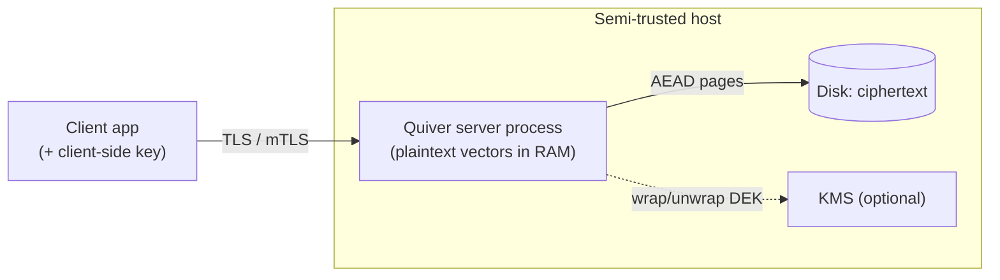

# Threat Model

Security is Quiver's foundation, not a feature. This document states what we defend, against whom, and — crucially — **what we honestly do *not* protect**. Overclaiming would discredit a security-first project. Crypto mechanisms are in [`crypto.md`](crypto.md); decisions in [ADR-0010](../adr/0010-crypto-envelope-aead.md)–[ADR-0014](../adr/0014-observability.md).

## Assets

- **Vector data** — embeddings can leak information about their source content (embedding-inversion attacks are real), so vectors are sensitive, not just metadata.
- **Payloads** — arbitrary, often PII or business data.
- **Keys** — master key, per-collection data-encryption keys (DEKs), API-key secrets.
- **Audit log integrity** and **service availability**.

## Adversaries

| # | Adversary | Primary defense |
|---|---|---|
| A1 | Network attacker (MITM) | TLS 1.3 (`rustls`); optional mTLS |
| A2 | Malicious / compromised **client** | AuthN (API key / mTLS), RBAC scopes, tenant isolation, rate & cost limits |
| A3 | Thief of **disk / backups** (data at rest) | Envelope encryption-at-rest (AEAD); crypto-shredding |
| A4 | Curious / compromised **server operator** (payloads) | **Client-side payload encryption** — server stores ciphertext it cannot read |
| A5 | Another **tenant** | Isolation enforced at the data-access layer; default-deny RBAC |
| A6 | **Supply-chain** attacker | `cargo deny`/`audit`, minimal pinned deps, SBOM, `gitleaks` |

## Trust boundaries

1. **Client ↔ Server (network).** TLS 1.3 always for non-loopback; optional mTLS. The server authenticates the client, authorizes the request scope, and scopes all data access to the tenant.
2. **Server ↔ Disk.** The filesystem is semi-trusted: everything at rest is AEAD-encrypted, so a stolen disk or backup yields only ciphertext.
3. **Server ↔ KMS (optional).** The master key may live in a KMS; plaintext DEKs exist only in server RAM and are zeroized after use.
4. **Client ↔ Server for payloads (optional client-side encryption).** When enabled, the **server is untrusted for payload confidentiality** — the trust boundary moves to the client, which encrypts payloads the server can only store and return as opaque blobs.

## What the server can and cannot see — stated honestly

**Without client-side encryption:** to build and search an ANN index, the server necessarily holds **vectors and payloads in plaintext in RAM** while serving. At rest they are encrypted. Therefore at-rest encryption defends against **A3 (stolen disk/backup)** — it does **not** defend against an adversary with **root on the live host** who can read process memory. That residual risk is documented, not hidden.

**With client-side payload encryption:** the server **never** sees payload plaintext, even in RAM. **But vectors remain plaintext server-side** because standard ANN math requires them — and vectors can leak information about their source. So:

> **Client-side payload encryption protects payloads, not vectors.** Confidentiality of *vectors* against the server is **not** provided by default. It is addressed only by the **experimental, opt-in** distance-comparison-preserving encryption (DCPE) mode — a *published* scheme ([ADR-0031](../adr/0031-dcpe-vector-encryption.md), [`dcpe.md`](./dcpe.md)) behind a per-collection flag, which by design **leaks the approximate distance-comparison relation** (that is how the server can still rank) and therefore carries real, documented leakage caveats: it is **not** semantically secure and is broken by known-plaintext or strong-prior adversaries. Quiver does **not** claim homomorphic-encrypted search in core, and never ships a home-grown scheme.

This precise boundary is the honest core of the security story.

## STRIDE summary

- **Spoofing** → API-key/mTLS authentication; keys hashed at rest, shown once.
- **Tampering** → AEAD integrity on every page; append-only audit log (optionally hash-chained).
- **Repudiation** → audit log records actor, action, resource, time.
- **Information disclosure** → the encryption layers above; tenant isolation; sanitized errors (no internal paths/secrets); secrets never logged.
- **Denial of service** → per-key/tenant rate limits; query **cost limits** (caps on `k`, `ef`, result size, concurrent queries); connection limits; request timeouts.
- **Elevation of privilege** → default-deny RBAC scopes; tenant isolation at the data layer; no anonymous writes; no default credentials.

## Crypto-shredding

Per-collection DEKs make **cryptographic erasure** a first-class operation: destroy a collection's wrapped DEK and its at-rest data — including any backups — becomes unrecoverable, satisfying "right to erasure" without hunting down every copy.

## Verification

[**Fuzzing**](./fuzzing.md) of the wire-protocol and on-disk parsers (`cargo-fuzz` targets for the `Filter` JSON parser and the page/WAL decoders — malformed input must reject cleanly, never panic); `cargo audit`/`deny`; tests asserting (a) data files are ciphertext, (b) a client-side-encrypted payload is unreadable server-side, (c) RBAC denies cross-tenant/over-scope access, (d) a crypto-shredded collection is unrecoverable, (e) the audit log records actor/action/resource without leaking secrets, and (f) a DCPE-encrypted query returns the right neighbour while the plaintext vector never reaches disk (the scoped ADR-0031 guarantee). Tracked under risks R3/R4/R8 in [`../risk-register.md`](../risk-register.md).
